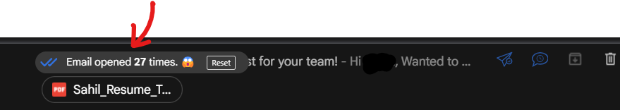

# 🎉 Welcome to the Personalized Message Generator! 🎉
Hey there! 👋 If you're looking to craft personalized messages for recruiters using your background information and a free LLM, you’ve come to the right place! This README will guide you through setting up and using this project smoothly. Let’s get started! 🚀


## SIMPLE, PERSONALISED MAILS TO RECRUITERS!

In the process of applying to multiple jobs, cold emailing on LinkedIn hasn't been greatly successful. I've seen videos and even observed firsthand how emailing is the way to go. Using mailtracker has shown me how people generally open my mails WITHIN MINUTES!


**Believe me, this is NOT CLICKBAIT!** <br>



## The Solution
A fairly simple, fairly basic, automatic mail-sender to recruiters! Personalised messages too! I'm currently using Gemini, but you can easily change that in one line!

# 📦 Getting Started

## 1. Clone the Repository
First things first, clone the repository to your local machine:
bash
```bash
git clone https://github.com/PoptropicaSahil/Automatic-personalised-emails.git
cd Automatic-personalised-emails
```

## 2. Create a Virtual Environment 🐍
It's a good idea to create a virtual environment to keep your dependencies organized. You can do this by running:
```bash
python -m venv venv
```

Activate the virtual environment:
* **On Windows**
```bash
venv\Scripts\activate
```
* **On macOS/Linux:**
```bash
source venv/bin/activate
```


## 3. Install Requirements 📦
Now, install the required packages with:
```bash
pip install -r requirements.txt
```


## 4. Set Up Your Environment Variables 🔑
You'll need to create a `.env` file in the root directory of the project. This file will hold your sensitive information.
Add the following lines to your `.env` file:
```text
EMAIL_ID = "<email id>"
APP_PASSWORD = "<app password for>"
OPENROUTER_API_KEY = "<key>"
```

> NOTE: The `APP_PASSWORD` is not your email's password. For (simple) instructions to setup the app password for your account check the [link](https://support.google.com/accounts/answer/185833?hl=en)

[OpenRouter](https://openrouter.ai/) is amazing! It allows us to use a ton of models, easily, with the same API call format. <br> 
We will use the Gemini 1.5 Flash-8B model (`google/gemini-flash-1.5-8b`). **The model is free!**


## 5. Customize Your Background Information 📝
Head over to `config.py` and change your background information in the second system prompt. This is crucial for generating personalized messages that reflect your unique qualifications and experiences!


## 6. Update Your Excel File 📊
Don’t forget to keep updating the name, company, and mail_sent columns in the provided Excel file at `contacts/contacts.xlsx`. **This is your main point of contact**, so keeping it up-to-date is super important!

**NOTE :** Since the idea is to generate a lot of emails, we simply guess the recruiter's email id as `first_name.last_name@company.com`. Therefore, it is cruicial that the `Name` column has both the first and last names. Otherwise, we simply send the mail to `first_name@company.com`(which is most likely not the correct email id xD)

# 🚀 Using the Project 

## Checklist
✅ The `.env` has information as defined above
✅ Ensure you keep your resume (to be attached with the mail!) in the `./resumes/` directory as a `.pdf` <br>
✅ Ensure you keep the contacts file in the `./contacts/` directory as a `.xlsx`  <br>
✅ To the people in the contacts file you want to send the mail, the *Sent_Indicator* column should be set to `No` <br>
✅ Setup information in the `config.py` file. This includes your *CONTACTS_FILE_PATH* , *BASE_RESUME_PATH*, and the *model_name* <br>
✅ Update the prompts and your information in the *prompts.py* file <br>

Once you setup information in the `config.py` file , you can run the script that generates personalized messages based on your background information and the specified company name. 
```bash
python main.py
```

Feel free to explore and modify the code as needed! If you want to change the LLM model, you can do that in just one line of code. How cool is that? 😎

## How it works
The project utilizes the `yagmail` library to streamline sending personalized emails. 📨 It crafts messages tailored to each company using your background information and attaches your resume, renaming it with the company's suffix for added customization. This approach not only showcases your intent but also helps your application stand out! 🌟 With `yagmail` handling the email logistics, you can focus on making meaningful connections with potential employers!

## TODOs
* Support names with three words. Currently we only support 2
* [FIXED] Currently we rename resumes hardocoded to Sahil Girhepuje only. Add logic to make it modular


## 🙌 A Big Shoutout!
A huge thank you to **Nick Singh** and **Jerry Lee** for their fantastic cold-email tricks and amazing content! Also to Jake Ryan for the awesome resume template! 🎉👏 

We hope you enjoy using this project as much as we enjoyed creating it! If you have any questions or suggestions, feel free to reach out. Happy emailing! 💌✨
